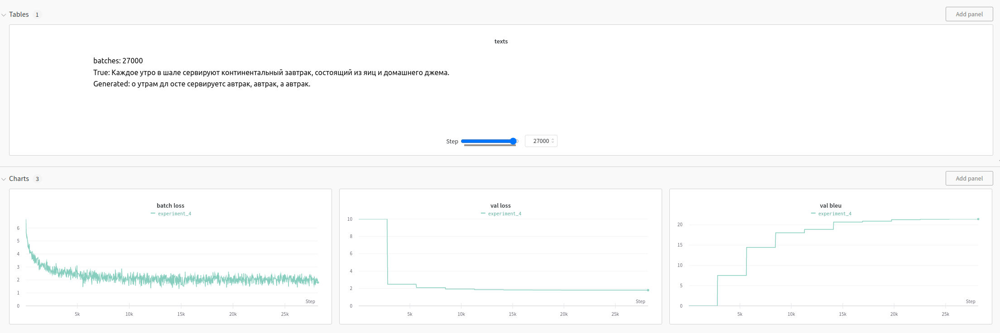
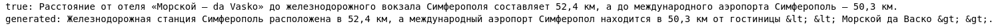

# Отчет
## Задание
получить модели для перевода en -> ru с bleu не меньше 21.

## Данные
50 000 переводов описания отелей.
```
Macedonia International Airport is 130 km away.	Расстояние до международного аэропорта «Македония» составляет 130 км.
All units also include a private bathroom with shower equipped with a hairdryer.	Все номера располагают собственной ванной комнатой с душем и феном.
```
## Эксперимент 1
В качестве модели были выбраны разные encoder и decoder предобученные на задачу языкового моделирования, в эксперименте обучалась их связка на задачу перевода.
```
encoder - distilbert-base-multilingual-cased
decoder - t5-small
bleu - 21.2
```

Общий смысл предложения понять можно, но качество оставляет желать лучшего


## Эксперимент 2
Посмотрим на модель предобученную на задачу перевода.
```
model - Helsinki-NLP/opus-mt-en-ru
bleu - 46.1
```


Отличный перевод, только символы <> не отобразились.

## Эксперимент 3
Попробуем дообучить модель на наших данных
