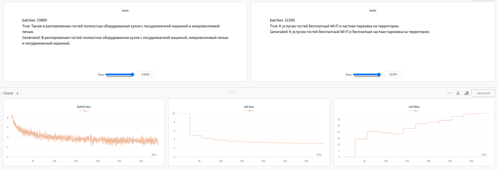
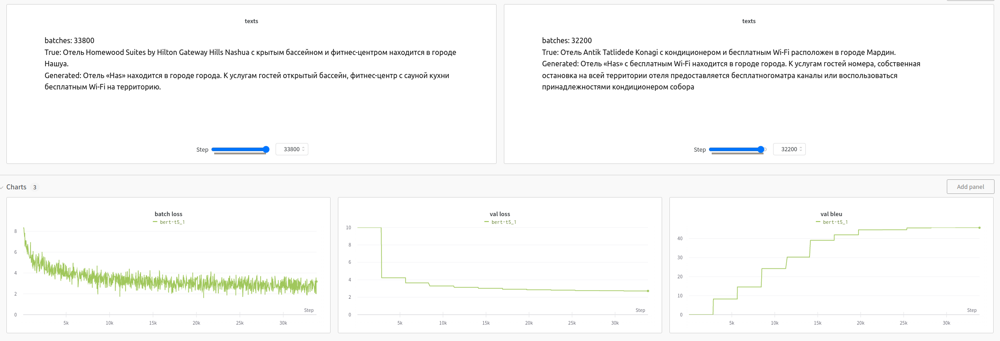
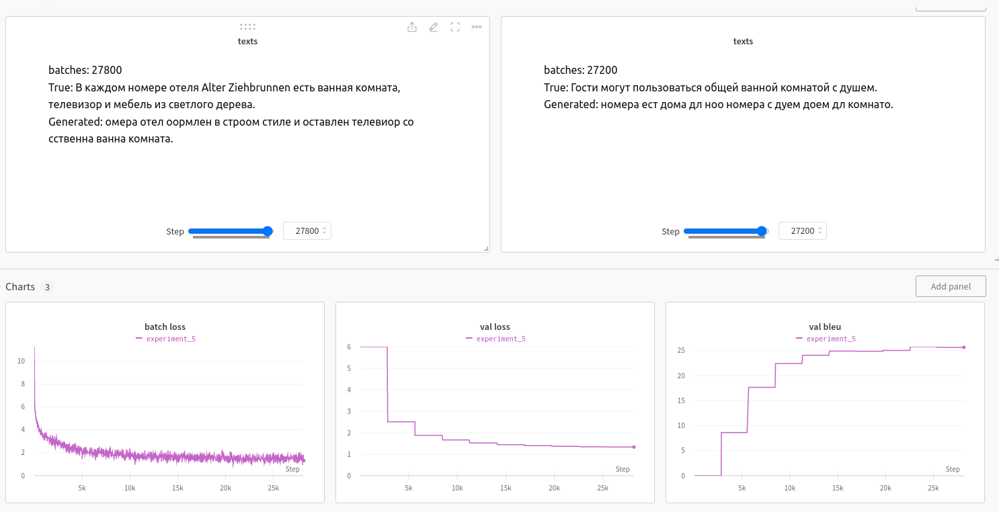
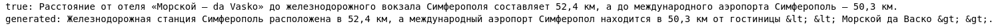
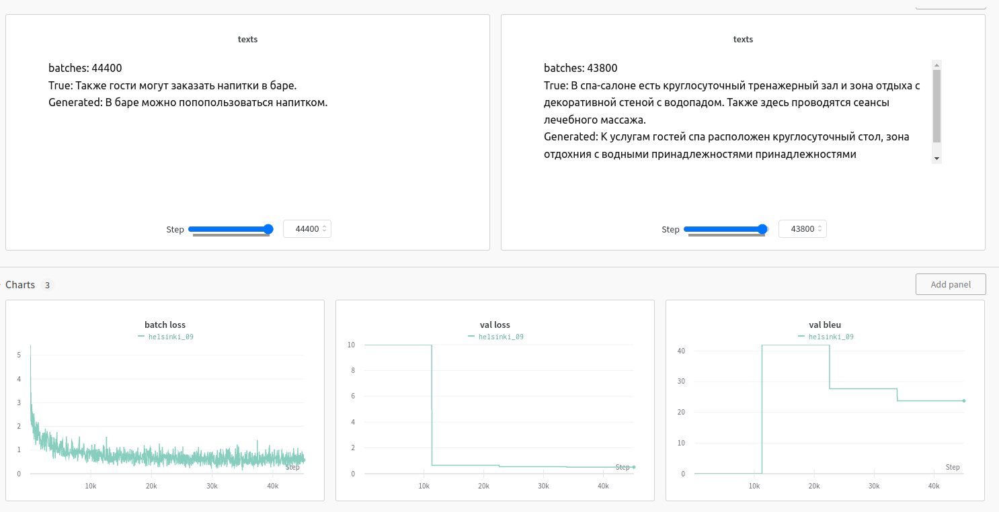

# Отчет
 
## Задание
получить модели для перевода en -> ru с bleu не меньше 21.

## Данные
50 000 переводов описания отелей. Пример:
```
Macedonia International Airport is 130 km away.	Расстояние до международного аэропорта «Македония» составляет 130 км.
All units also include a private bathroom with shower equipped with a hairdryer.	Все номера располагают собственной ванной комнатой с душем и феном.
```
## Эксперимент 1
Обучим модель Т5 с нуля. Токенайзер возьмем предобученный
```
model - t5
bleu - 36.8
```


Хороший перевод, но с повторениями. Возможно `repetition_penalty` улучшил бы результат, но и так достаточно хорошо.

## Эксперимент 2
Попробуем поменять декодер на предобученный берт.

```
model - bert + t5
bleu - 46.8
```


Хороший предобученный энкодер дал значительный прирост качества.

## Эксперимент 3
Ошибочный эксперимент, где я не посмотрел язык токенизатора (неменцкий, английский, французский и румынский). В итоге модель обучилась без некоторых русских букв, типа 'з', 'ш' и др.
```
model - bert + t5
bleu - 27.4
```


Даже без некоторых букв модель выдает нужное качество, что достаточно забавно.


## Эксперимент 4
Посмотрим предобученную модель.
```
model - Helsinki-NLP/opus-mt-en-ru
bleu - 46.1 / 23.2
```


Отличный перевод, только символы <> не отобразились.

Попробуем дообучить модель на наших данных



Качество упало. Скорее всего прошло недостаточно эпох обучения.

## Вывод
Attention is all you need. Учить трансофрмеры с нуля оказалось не так страшно. 

В процессе работы изучены библиотеки transformers и wandb.

Качество обученной модели bert+t5 оказалось выше, чем у предобученного переводчика helsinki, видимо для данного домена предобученные переводчики можно дообучать и получать еще лучшее качество. Хотя, как известно bleu не отражает качество перевода на 100%.

После проведения экспериментов в ноутбуках были найдены баги, которые качественно не влияют на результаты, поэтому обучать все еще раз не стал.


