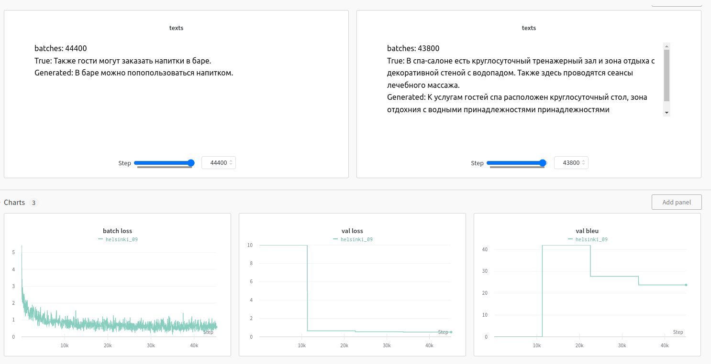

# Отчет
 
## Задание
получить модели для перевода en -> ru с bleu не меньше 21.

## Данные
50 000 переводов описания отелей. Пример:
```
Macedonia International Airport is 130 km away.	Расстояние до международного аэропорта «Македония» составляет 130 км.
All units also include a private bathroom with shower equipped with a hairdryer.	Все номера располагают собственной ванной комнатой с душем и феном.
```
## Эксперимент 1
~~В качестве модели были выбраны разные encoder и decoder предобученные на задачу языкового моделирования, в эксперименте обучалась их связка на задачу перевода.~~

Скорее всего модель не дообучилась, но итоговая метрика удовлетворяет заданию.
```
model - t5
bleu - 36.8
```

~~Общий смысл предложения понять можно, но качество оставляет желать лучшего~~
~~Заметим, что предобученный декодер не знает русского языка, поэтому можно сказать, что качество модели в большей степени зависит от того, как обучится декодер. Будем считать, что предобученные веса помогают модели быстрее сойтись.  ~~

## Эксперимент 2
В качестве модели были выбраны разные encoder и decoder предобученные на задачу языкового моделирования, в эксперименте обучалась их связка на задачу перевода.

Скорее всего модель не дообучилась, но итоговая метрика удовлетворяет заданию.
```
model - t5
bleu - 36.8
```


## Эксперимент 3
Посмотрим на модель предобученную на задачу перевода.
```
model - Helsinki-NLP/opus-mt-en-ru
bleu - 46.1
```


Отличный перевод, только символы <> не отобразились.

Попробуем дообучить модель на наших данных



Качество упало. Скорее всего наш датасет хуже отражает распределение русского языка, и, обучая модель, мы ломаем часть языкового моделирования (в примерах видно, что слова складываются из неправильных токенов, поэтому и получаются орфографические ошибки).

## Вывод
Для обучения трансформера датасета в 50 000 примеров - недостаточно, т.к. модель не выучивает язык (для T5 примеров на русском ~1 млрд). Однако общий смысл перевода можно уловить. 


